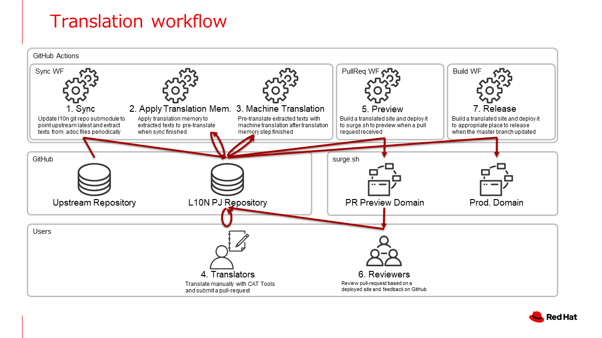

# ja-pcp-website

Japanese Localization project for [https://github.com/performancecopilot/pcp-website](https://github.com/performancecopilot/pcp-website) (The repository for [pcp.io website](https://pcp.io))

Localized site: [https://ja-pcp.surge.sh/](https://ja-pcp.surge.sh)

## Localization architecture

ja-pcp-website extracts texts to HTML files with [po4a](https://po4a.org/) utility, translates, 
write back to HTML files, and build a localized site.
Most workflow including pre-translation by DeepL API are automated by GitHub Actions. 
Translators can focus on post-editing to improve fluency.
If you are interested in contributing localization, please edit .po files, and submit a pull request.



### HTML files localization

#### sync workflow

ja-pcp-website GitHub repository has a GitHub Actions workflow which checks upstream repository(submodule) update, 
extracts texts from upstream HTML files to [.html.po files](l10n/po), pre-translate with a translation memory 
and the DeepL API.

#### Translating .po files

.po files in [l10n/po](l10n/po) directory need to be translated. 
.po file is a file format commonly used for software internationalization, and many CAT software and SaaS can read/write.
[POEdit](https://poedit.net/), which run on Windows/Mac/Linux is a good candidate.
Since .po files are pre-filled with machine translation with "fuzzy" mark, 
please remove "fuzzy" mark and correct inappropriate sentences if needed.

#### Build a localized site

When you send a pull-request, GitHub Actions workflow automatically apply translations in .po files to .html files,
build a localized site and deploy it to surge.sh with preview domain. When the deploy finish, GitHub Actions comment 
the URL to the pull-request. Reviewers can check the deployed site for review.
When the pull-request is merged into `master`, it is automatically deployed to the production site (https://ja-pcp-website.surge.sh).

#### Build a localized site locally

If you would like to build a site locally, run:

```
bin/apply-translation
bin/exec-jekyll
```

The site is build in `doc` directory.

### HTML templates localization

Most contents of [pcp.io](https://pcp.io) are in .html files, but a few texts are in its HTML templates.
Since HTML templates cannot be parsed with [po4a](https://po4a.org/) utility, this localization project repository has their
localized copies in the [l10n/override](l10n/override) directory. When the templates in the upstream repository are 
updated, GitHub Actions workflow automatically create a issue to let you know. 
Please refer the [l10n/stats/override.csv](l10n/stats/override.csv) to check which files are updated, and update the override files 
to keep it up to date.

## FAQ

### Some guides or blog posts are not translated.

These articles are not translated, but don't worry. Machine-translation is available in the corresponding .html.po file.
We'll appreciate if you post-edit the .html.po files to polish up, remove "fuzzy" mark, and send a pull-request.

### Some sentences are not translated in the translated articles

It seems corresponding upstream sentences are updated, and completed translations are not available. 
We'll appreciate if you post-edit the corresponding .html.po files to polish up, remove "fuzzy" mark, and send a pull-request.

## Contributing

Submitting a pull request, and reporting an issue are all welcome.

For translators, we have a [translation guide(ja)](./translation-guide.ja.md).

## License

ja-pcp-website is Open Source Project released under the
[Apache 2.0 license](http://www.apache.org/licenses/LICENSE-2.0.html).
